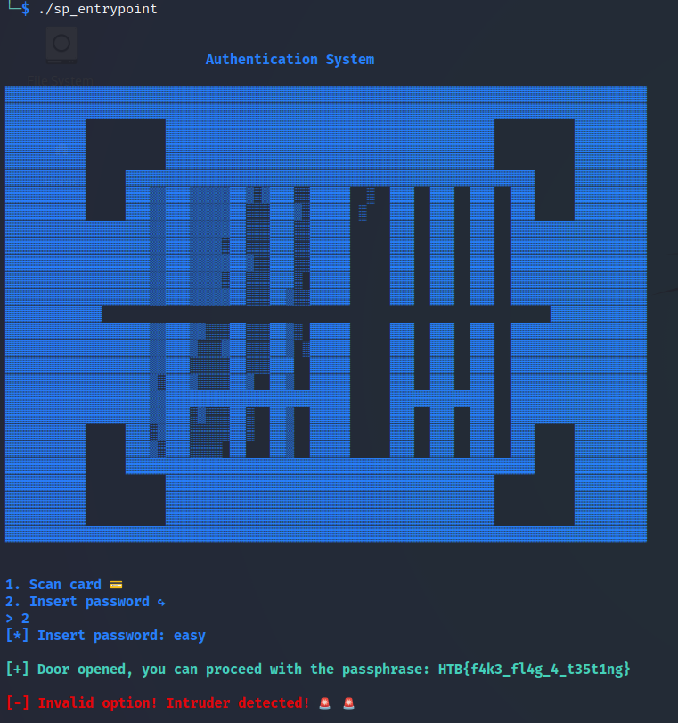

# __Space Pirate: Entrypoint__

### __Challenge Info__

> D12 is one of Golden Fang's missile launcher spaceships. Our mission as space pirates is to highjack D12, get inside the control panel room, and access the missile launcher system. To achieve our goal, we split the mission into three parts. In this part, all we need to do is bypass the scanning system and open the gates so that we proceed further.

 

To solve this challenge we get an ELF 64-bit LSB pie executable x86-64 called __sp_entrypoint__ and a folder named __glibc__ with the dependencies needed to run the executable.

Let's run the file.

When we insert a random password, the program gives us the flag __`HTB{f4k3_fl4g_4_t35t1ng}`__

 

Start the docker instance and [nc](https://linux.die.net/man/1/nc "nc") into it to get the real flag __`HTB{th3_g4t35_4r3_0p3n!}`__