# __Rebuilding__

### __Challenge Info__

> You arrive on a barren planet, searching for the hideout of a scientist involved in the Longhir resistance movement. You touch down at the mouth of a vast cavern, your sensors picking up strange noises far below. All around you, ancient machinery whirrs and spins as strange sigils appear and change on the walls. You can tell that this machine has been running since long before you arrived, and will continue long after you're gone. Can you hope to understand its workings?

 

The file that we get for this challenge is an ELF 64-bit LSB pie executable x86-64 called __rebuilding__.

When we execute the program with a password as a parameter we are prompted with the following: 

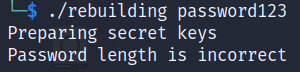

Looking at the output, we see that the program points out that the `Password length is incorrect`. So the first thing we are going to do is find the password length. Let's open the executable file __rebuilding__ in [Ghidra](https://ghidra-sre.org/ "Ghidra").

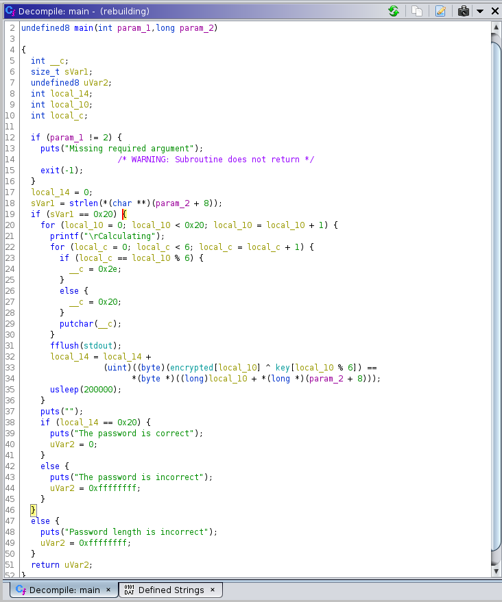

Looking at the _main_ function above we can see a conditional statement being made to check `if (sVar1 == 0x20)` on line 19. 0x20 in Hexadecimal is equal to 32 in Decimal. So the length of the password is 32 characters. Let's run the program with a random 32 characters password to see what happens.

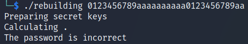

The program takes a few seconds `Calculating` and then returns `The password is incorrect`. Let's go back to Ghidra.

In line 38 of the _main_ function we see a conditional statement that check `if (local_14 == 0x20)` the program outputs _`The password is correct`_.

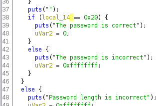

Analyzing the variable `local_14` previous appearances in the _main_ function we observe that in line 32 an array called `encrypted` is being XORed with a key.

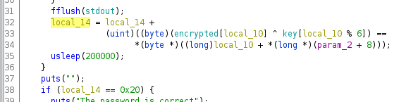

By clicking on `encrypted` we can see some data in hex.

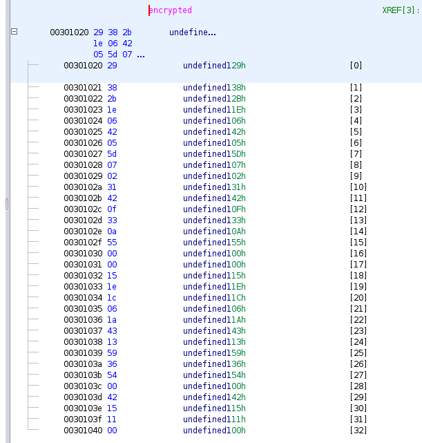

To quickly extract the Hexadecimal numbers to build the `encrypted` array, select all the data of the picture above, right click and select _`Copy Special...`_ .

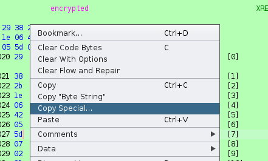

Then select _`Byte String`_ and click _`OK`_.

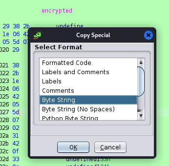

We extracted the following encrypted string in hex: __`29 38 2b 1e 06 42 05 5d 07 02 31 42 0f 33 0a 55 00 00 15 1e 1c 06 1a 43 13 59 36 54 00 42 15 11 00`__

 

Going back to the main function, by clicking on key we are able to view the string __`humans`__ that supposedly is used as a key to XOR the hex string above and decrypt the data.

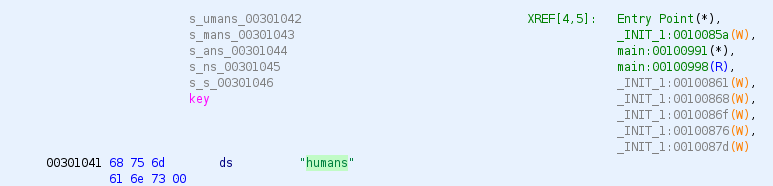

Now we go to [CyberChef](https://cyberchef.org/ "CyberChef") and use the key __`humans`__ to try to decrypt the hex string extracted earlier.

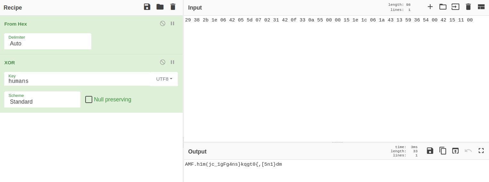

As we can see from the picture above, it didn't work. Let's go back to Ghidra.

 

After analyzing more in-depth the program in Ghidra we find a very interesting function called *_INIT_1*. Let's see what it does.

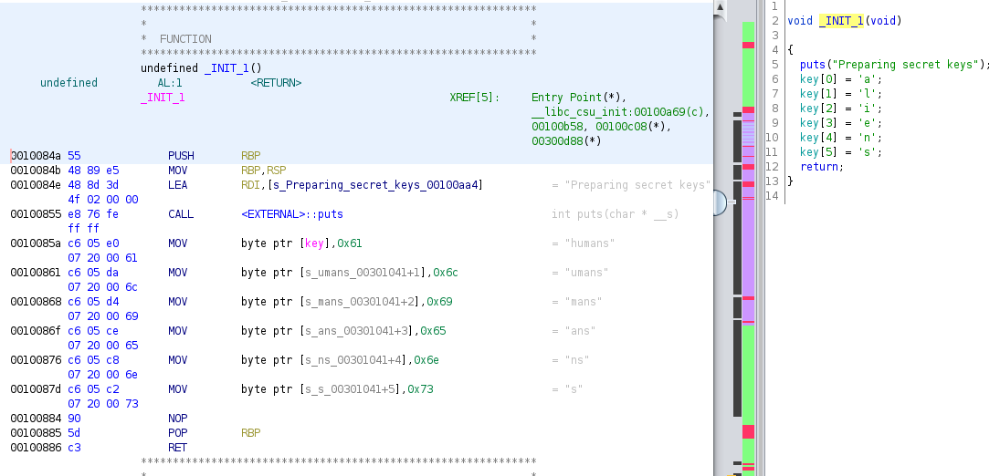

Looking at the assembly code on the left we can see that the __`humans`__ string is being replaced with the string __`aliens`__.  The decompiler section on the right helps us to better visualize each letter that is going to form this string. Let's test this string to see if we found the correct key to decrypt the hex data.

Go to CyberChef again and use the key __`aliens`__ to decrypt the hex string.

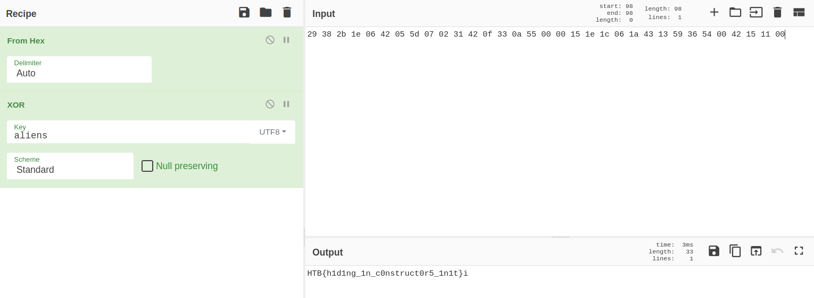

And we get the flag __`HTB{h1d1ng_1n_c0nstruct0r5_1n1t}`__